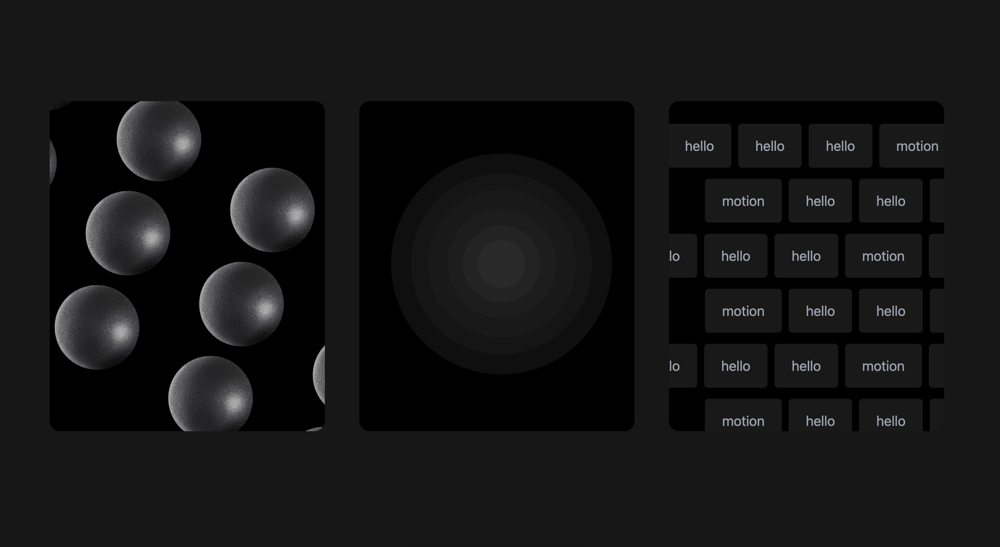

Quick project in which I'm experimenting and playing around with Framer Motion

In order to see all the 3d spheres in the First Card, please drag and drop!

Also, check it out on [Dribble](https://dribbble.com/shots/23633747-Animated-cards) as well, where you can see the video of the animations.

